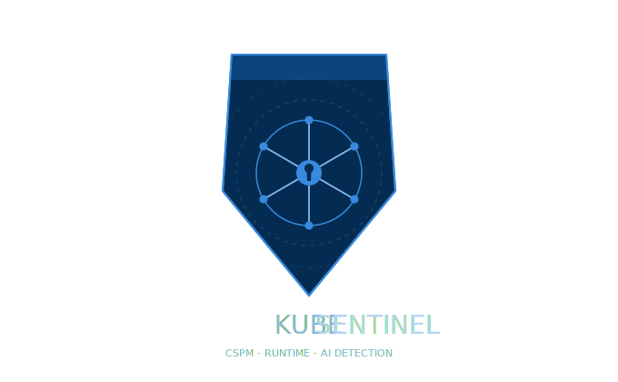

<div align="center">
  
  <h1>KubeSentinel</h1>
  <p>
    Cloud Security Posture Management (CSPM) framework for Kubernetes that combines static manifest analysis, runtime security monitoring, AI-assisted anomaly detection, and forensic reporting.
  </p>
</div>

## Table of Contents

- [About](#about)
- [Features](#features)
- [Tech Stack](#tech-stack)
- [Getting Started](#getting-started)
  - [Prerequisites](#prerequisites)
  - [Installation](#installation)
  - [Build](#build)
  - [Run](#run)
  - [Test](#test)
- [Usage](#usage)
- [Documentation](#documentation)
- [Contributing](#contributing)
- [Roadmap](#roadmap)
- [License](#license)

## About

KubeSentinel is designed to improve Kubernetes security across the full lifecycle:

- **Shift-left checks** with static policy scanning of manifests
- **Runtime visibility** through Falco event ingestion and monitoring
- **Behavior analytics** with a Python ML service
- **Forensic readiness** via structured evidence retention and reports

## Features

- **Static Policy Engine**: Detects risky Kubernetes configurations before deployment. Supported capabilities include:
  - **Secrets Scanning**: Detects hardcoded passwords, tokens, and credentials in manifests (similar to kubesec, checkov).
  - **Image Vulnerability Tracking**: Flags insecure image tags (`:latest`) and tracks supply-chain risk (integrates conceptually with Snyk/Trivy/Grype).
  - **NetworkPolicy Analysis**: Analyzes ingress/egress rules and default-deny policies (similar to cilium, checkov).
  - **Compliance Mapping**: Violations are automatically mapped to CIS Benchmarks, NIST SP 800-190, SOC2, and PCI-DSS (similar to kube-bench/Falco compliance mapping).
- **Runtime Monitor**: Streams and processes Falco security events
- **AI Behavioral Analyzer**: Flags anomalous behavior using Isolation Forest with configurable thresholds
- **LLM Triage Staging Vault**: High-risk anomalies staged in SQLite for human or Gemini review before forensics write
  - Optional LLM enrichment with MITRE ATT&CK classification
  - Passthrough mode for fast auto-confirmation
  - API override for manual triage decisions
- **Forensic Vault**: Confirmed incident evidence with retention, max-size pruning, and optional gzip compression
- **Report Generator**: Produces Markdown, JSON, and HTML investigation outputs
- **Gemini Enrichment (Optional)**: Adds runtime incident classification metadata and report narratives with redaction and deterministic fallback

## Tech Stack

- **Go 1.21+** for CLI and core services
- **Python 3.9+** for ML/anomaly detection
- **Kubernetes** (Minikube/Kind supported)
- **Falco** for runtime security events

## 👨‍💻 For Developers

- **[DEVELOPERS.md](DEVELOPERS.md)** - Quick start guide for contributors
- **[docs/REPOSITORY-STRUCTURE.md](docs/REPOSITORY-STRUCTURE.md)** - Repository organization and file placement
- **[docs/PROJECT-GUIDE.md](docs/PROJECT-GUIDE.md)** - Contribution guidelines

## Project Structure

```text
kubesentinel/
├── cmd/
│   └── kubesentinel/
│       └── main.go
├── internal/
├── pkg/
├── ai-module/
│   ├── server.py
│   ├── requirements.txt
│   └── models/
├── config/
├── deploy/
├── docs/
├── reports/
├── scripts/
│   ├── Makefile
│   ├── install.sh
│   └── install.ps1
├── tests/
├── go.mod
├── go.sum
└── requirements.txt
```

## Getting Started

### Prerequisites

- Go `1.21+`
- Python `3.9+`
- Docker
- Kubernetes (`minikube` or `kind`)
- Falco (for runtime monitoring scenarios)

### Installation

```bash
git clone <your-repo-url>
cd kubesentinel
```

Install dependencies:

```bash
make -C scripts deps
```

### Build

```bash
make -C scripts build
```

### Run

Static scan example:

```bash
./bin/kubesentinel scan --path ./deploy
```

Runtime monitor example:

```bash
./bin/kubesentinel monitor --namespace production --deployment api
```

### Host volume setup (Kubernetes)

Ensure the host path used by the deployments exists before applying manifests. Create the forensics directory and parent data directory on the host:

```bash
sudo mkdir -p /var/lib/kubesentinel/forensics
sudo chown 1000:1000 /var/lib/kubesentinel /var/lib/kubesentinel/forensics
```

When running in Kubernetes, mount `/var/lib/kubesentinel` (or a PV) into the pods so the AI service can read `/app/forensics` and persist `staging.db` at `/var/lib/kubesentinel/staging.db`.

### Test

```bash
make -C scripts test
```

Run only AI staging tests:

```bash
cd ai-module
python -m pytest tests/test_staging_api.py -v
```

Integration test (requires running AI service):

```bash
python -m pytest tests/test_anomaly_detector.py -v
go test -v -run TestAIIntegration ./internal/runtime  # Requires: make run-ai
```

## Usage

Common commands:

```bash
./bin/kubesentinel scan --path ./deploy
./bin/kubesentinel monitor --namespace production --deployment api --workers 4
./bin/kubesentinel report --from "2026-03-01" --to "2026-03-31" --format markdown,json
./bin/kubesentinel report --incident-id <record-id> --format html --no-llm
```

Config highlights:

```yaml
forensics:
  storage_path: "./forensics"
  retention_days: 90
  max_size_mb: 1000
  compression: true

reporting:
  formats: ["json", "markdown", "html"]
  output_path: "./reports"

gemini:
  enabled: false
  classify_runtime: false
  api_key: ""
  model: "gemini-2.5-flash"
  timeout_seconds: 15
```

AI service environment variables:

```bash
STAGING_DB_PATH=/app/staging.db       # SQLite path for staging vault
TRIAGE_POLL_INTERVAL=30               # Seconds between triage worker polls
TRIAGE_BATCH_SIZE=10                  # Max incidents processed per poll cycle
ENRICH_WITH_GEMINI=true               # Enable LLM-based triage (false = passthrough auto-confirm)
GEMINI_API_KEY=<key>                  # Gemini API key for LLM enrichment
```

Runtime triage flow:

```text
Falco event → Go producer builds incident payload
              ↓
          /predict (with incident_data)
              ↓
         Isolation Forest scores >= 0.5
              ↓
      Staging vault (SQLite, status='pending')
              ↓
  Background triage worker polls every 30s
              ↓
    ┌─────────────────────────┬──────────────────────┐
    │                         │                      │
  Gemini verdict        Passthrough mode      On error
    │                    (no Gemini)          (stay pending)
    ├─ confirmed         auto-confirmed            │
    │   (→ forensics)     (→ forensics)            │
    └─ rejected
    (stay in staging)
```

### Staging Vault Details

- **Database**: SQLite with WAL mode for concurrent read/write performance
- **Passthrough Mode**: Set `ENRICH_WITH_GEMINI=false` to auto-confirm all pending incidents without calling Gemini
- **Logging**: Staging failures log incident metadata (namespace-pod-rule) for pod log correlation
- **Override API**: `POST /api/staging/<id>/override` with `{"verdict": "confirmed|rejected", "reason": "..."}` (requires `TRAINING_API_TOKEN`)

## Documentation

Complete documentation is organized in the [docs/](docs/) directory:

### 🚀 Getting Started
- [Getting Started Guide](docs/getting-started.md) - Installation and first run
- [CSPM Quick Start](CSPM-QUICK-START.md) - Python CSPM module guide
- [Quick Reference](docs/quick-reference.md) - Command reference and examples

### 🏗️ Architecture & Design
- [Architecture](docs/architecture.md) - System design and components
- [Project Guide](docs/PROJECT-GUIDE.md) - Project structure and guidelines
- [Repository Structure](docs/REPOSITORY-STRUCTURE.md) - Directory organization and file placement

### ☸️ Deployment & Operations
- [Kubernetes Deployment](deploy/KUBERNETES-DEPLOYMENT.md) - K8s DaemonSet, RBAC, and production setup
- [Prometheus Metrics](docs/PROMETHEUS-METRICS.md) - Observability, metrics, and alerting
- [Docker Compose Setup](docker-compose.yml) - Local development stack

### 📚 Additional Resources
- [Testing Guide](TESTING.md) - Test strategies and running tests
- [Implementation Roadmap](docs/implementation-roadmap.md) - Planned features
- [Documentation Index](docs/README.md) - Complete documentation index with search table

## Roadmap

- [x] Static analysis engine
- [x] Runtime monitoring pipeline
- [x] Forensic report generation
- [ ] Threat-intelligence enrichment
- [ ] Dashboard and observability enhancements

## Contributing

Contributions are welcome. Open an issue for bugs/feature requests and submit a PR for improvements.

## License

No license file is currently present in this repository. Add one (for example MIT/Apache-2.0) to define reuse terms.
